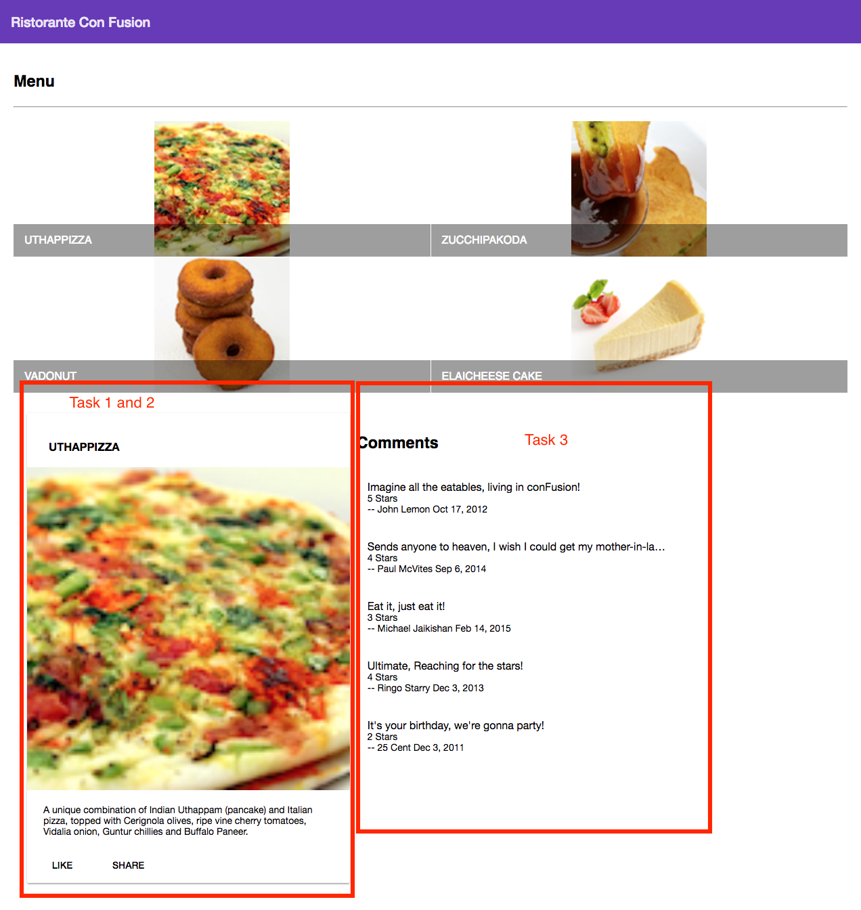

Table of Contents
=================

- [Introduction](#introduction)
- [Week 1](#week-1)
	- [Basics of Node.js and NPM](#basics-of-nodejs-and-npm)
	- [Getting Started with Angular](#getting-started-with-angular)
	- [Configuring your Angular Application](#configuring-your-angular-application)
	- [Angular Components Part 1](#angular-components-part-1)
	- [Angular Components Part 2](#angular-components-part-2)
- [Week 2](#week-2)
- [Week 3](#week-3)
- [Week 4](#week-4)

Introduction
============

About this course: This course concentrates mainly on Javascript based front-end frameworks, and in particular the Angular framework (Currently Ver. 4.x). This course will use Typescript for developing Angular application. Typescript features will be introduced in the context of Angular as part of the exercises. You will also get an introduction to the use of Angular Material and Angular Flex-Layout for responsive UI design. You will be introduced to various aspects of Angular including components, directives and services. You will learn about data binding, Angular router and its use for developing single-page applications. You will also learn about designing both template-driven forms and reactive forms. A quick introduction to Observables, reactive programming and RxJS in the context of Angular is included. You will then learn about Angular support for client-server communication and the use of REST API on the server side. You will use Restangular for communicating with a server supporting the REST API. A quick tour through Angular animation support and Angular testing rounds off the course. You must have either completed the previous course in the specialization on Bootstrap 4, or have a working knowledge of front end web-UI frameworks to be able to navigate this course. Also a good working knowledge of JavaScript, especially ES 5 is strongly recommended.

At the end of this course you will:

- Be familiar with client-side Javascript frameworks and the Angular framework
- Be able to implement single page applications in Angular
- Be able to use various Angular features including directives, components and services
- Be able to implement a functional front-end web application using Angular
- Be able to use Angular Material and Angular Flex-Layout for designing responsive Angular applications
- Be able to use Observables and RxJS in the context of Angular applications

Who is this class for: This course is aimed at students with sufficient knowledge of Web technologies like HTML, CSS and JavaScript. A good working knowledge of JavaScript, especially ES 5 is strongly recommended.

---

https://www.coursera.org/learn/angular

Week 1
======

- [Basics of Node.js and NPM](#basics-of-nodejs-and-npm)
	- [Objectives and Outcomes](#objectives-and-outcomes)
	- [Initializing package.json](#initializing-packagejson)
	- [Installing an NPM Module](#installing-an-npm-module)
	- [Setting up .gitignore](#setting-up-gitignore)
	- [Conclusions](#conclusions)
- [Getting Started with Angular](#getting-started-with-angular)
	- [Objectives and Outcomes](#objectives-and-outcomes-1)
	- [Installing *Angular-CLI*](#installing-angular-cli)
	- [Generating and Serving an Angular Project using Angular-CLI](#generating-and-serving-an-angular-roject-using-angular-cli)
	- [Conclusions](#conclusions-1)
- [Configuring your Angular Application](#configuring-your-angular-application)
	- [Objectives and Outcomes](#objectives-and-outcomes-2)
	- [Configure your Angular Project to use Angular Material](#configure-your-angular-project-to-use-angular-material)
	- [Configure to use Material Design Icons](#configure-to-use-material-design-icons)
	- [Configure your Angular Project to use Flex Layout](#configure-your-angular-project-to-use-flex-layout)
	- [Updating AppModule](#updating-appmodule)
	- [Adding a Material Toolbar](#adding-a-material-toolbar)
	- [Adding Styles](#adding-styles)
	- [Conclusions](#conclusions-2)
- [Angular Components Part 1](#angular-components-part-1)
	- [Exercise Resources](#exercise-resources)
	- [Objectives and Outcomes](#objectives-and-outcomes-3)
	- [Adding a Menu Component](#adding-a-menu-component)
	- [Creating the Menu](#creating-the-menu)
	- [Conclusions](#conclusions-3)
- [Angular Components Part 2](#angular-components-part-2)
	- [Objectives and Outcomes](#objectives-and-outcomes-4)
	- [Updating the Menu Template](#updating-the-menu-template)
	- [Add a Card Component](#add-a-card-omponent)
	- [Conclusions](#conclusions-4)

Basics of Node.js and NPM
-------------------------

### Objectives and Outcomes

In this exercise you will learn the basics of Node and NPM. At the end of this exercise, you will be able to:

- Set up package.json file in the project folder for configuring your Node and NPM for this project
- Install a NPM module and make use of it within your project

### Initializing package.json

At the command prompt in your **git-test** folder, type

```
npm init
```

Follow along the prompts and answer the questions as follows: accept the default values for most of the entries, except set the entry point to index.html
This should create a *package.json* file in your **git-test** folder.

### Installing an NPM Module

Install an NPM module, lite-server, that allows you to run a Node.js based development web server and serve up your project files. To do this, type the following at the prompt:

```
npm install lite-server --save-dev
```

You can check out more documentation on lite-server [here](https://github.com/johnpapa/lite-server).
Next, open package.json in your editor and modify it as shown below. Note the addition of two lines, line 7 and line 9.

```json
{
  "name": "git-test",
  "version": "1.0.0",
  "description": "This is the Git and Node basic learning project",
  "main": "index.html",
  "scripts": {
    "start": "npm run lite",
    "test": "echo \"Error: no test specified\" && exit 1",
    "lite": "lite-server"
  },
  "repository": {
    "type": "git",
    "url": "git+https://jogesh_k_muppala@bitbucket.org/jogesh_k_muppala/git-test.git"
  },
  "author": "",
  "license": "ISC",
  "homepage": "https://bitbucket.org/jogesh_k_muppala/git-test#readme",
  "devDependencies": {
    "lite-server": "^2.2.2"
  }
}

```

Next, start the development server by typing the following at the prompt:

```
npm start
```

This should open your *index.html* page in your default browser.
If you now open the *index.html* page in an editor and make changes and save, the browser should immediately refresh to reflect the changes.

### Setting up .gitignore

Next, create a file in your project directory named *.gitignore* (**Note**: the name starts with a period)Then, add the following to the .gitignore file

```
node_modules
```

The do a git commit and push the changes to the online repository. You will note that the node_modules folder will not be added to the commit, and will not be uploaded to the repository.

### Conclusions

In this exercise you learnt to set up package.json, install a npm package and start a development server.

Getting Started with Angular
----------------------------

### Objectives and Outcomes

In this first Angular exercise, you will first install *angular-cli*, the command line tool for scaffolding Angular applications. You will then use the tool to scaffold out a basic Angular application. We will thereafter develop this application into a full-fledged Angular application in the process of doing the exercises in this course. At the end of this exercise you will be able to:

- Install *angular-cli*
- Scaffold out a basic Angular application

### Installing *Angular-CLI*

From the Angular-CLI documentation we learn that the Angular-CLI makes it easy to create an application that already works, right out of the box. It already follows the best practices suggested by the Angular community!

To install *angular-cli* globally, type the following at the prompt:

```
npm install -g @angular/cli
```

**Note**:Use *sudo* on a Mac and Linux

This will make the command line tool for creating Angular applications. To learn more about the various commands that this CLI provides, type at the prompt:

```
ng help
```

### Generating and Serving an Angular Project using Angular-CLI

At a convenient location on your computer, create a folder named *Angular* and move into that folder.
Then type the following at the prompt to create a new Angular application named *conFusion*:

```
ng new conFusion -dir=<The path of your Angular folder>/conFusion --style=scss
```

This should create a new folder named *conFusion* within your *Angular* folder and create the Angular application in that folder.
Move to the conFusion folder and type the following at the prompt:

```
npm install
ng serve --open
```

This will compile the project and then open a tab in your default browser at the address http://localhost:4200.
You can initialize your project to be a Git repository by typing the following commands at the prompt:

```
git init
git add .
git commit -m "Initial Setup"
```

**Note**: Some of you may find that Angular CLI automatically does the first commit on your computer and initializes the Git repository. Please do a "git status" in the project folder just to check if an automatic commit has been done. This doesn't happen on my computer. Hence the above instructions.

Thereafter you can set up an online Git repository and synchronize your project to the online repository. Make sure that the online Git repository is a private repository.

### Conclusions

In this exercise you installed the Angular CLI tool and created a basic Angular project and served up the compiled project to your browser.

Configuring your Angular Application
------------------------------------

### Objectives and Outcomes

In this exercise we will set up our project to use Angular Material and Angular Flex Layout. We will then introduce our first Angular Material component into our application. At the end of this exercise you will be able to:

- Configure your Angular project to use Angular Material and Flex Layout.
- Start using Material components in your application.

### Configure your Angular Project to use Angular Material

**Note**: This course is designed with Angular Material Beta.3. Before you proceed forward, you may wish to read the detailed information posted in https://www.coursera.org/learn/angular/discussions/all/threads/4yxVk7DXEee0mQrUfDuicA where I have clearly explained about dealing with the newer Beta versions of Angular Material (up to Beta.12). I would strongly suggest that to proceed ahead with the course with minimal disruption, please install the Beta.8 version of Angular Material. With this installation, the course instructions will still work as given.

To configure your project to use Angular material, type the following at the prompt to install Angular Material, Angular Animations and HammerJS:

```
npm install @angular/material@2.0.0-beta.8 --save
npm install @angular/cdk@2.0.0-beta.8 --save
npm install --save @angular/animations 
npm install --save hammerjs 
```

### Configure to use Material Design Icons

Next, include the following into the <head> of index.html to make use of Material Design icons:

```html
<link href="https://fonts.googleapis.com/icon?family=Material+Icons" rel="stylesheet"> 
```

### Configure your Angular Project to use Flex Layout

Next, install Angular Flex Layout as follows:

```
npm install --save @angular/flex-layout@latest 
```

### Updating AppModule

Then, you need to import the Angular Animations Module, Angular Material Module, Flex Layout Module and hammerjs into your root module (src/app/app.module.ts) as follows:

```ts
. . . 

import { BrowserAnimationsModule } from '@angular/platform-browser/animations';
import { MaterialModule } from '@angular/material'; 
import { FlexLayoutModule } from '@angular/flex-layout';

. . . 

import 'hammerjs';

@NgModule({
  
  . . . 
  
  imports: [ 
    
    . . .,
    
    BrowserAnimationsModule,
    MaterialModule,
    FlexLayoutModule
    
  ], 
    
    . . . 
  
  
}) 

. . . 
```

### Adding a Material Toolbar

Open app.component.html and replace its contents with the following code:

```html
<md-toolbar color="primary"> <span>Ristorante Con Fusion</span> </md-toolbar>
```

### Adding Styles

Add the following styles to styles.scss file:

```scss
@import '~@angular/material/prebuilt-themes/deeppurple-amber.css';

// some basic resets 

body { 
  padding: 0; 
  margin: 0; 
  font-family: Roboto, sans-serif; 
  
}
```

This will add a built-in Material theme to our application.
Do a Git commit with the message "Configuring Angular"

### Conclusions

In this exercise we learnt to use Angular Material and Flex Layout NgModules in our Angular application.

Angular Components Part 1
-------------------------

### Exercise Resources

[images.zip](resources/_db284e833226b010f3e252d9220f85d5_images.zip)

### Objectives and Outcomes

In this exercise you will add the first component to your Angular application and update its template. At the end of this exercise you will be able to:

- Add components to your Angular application
- Update the templates of your component.

### Adding a Menu Component

First, download the images.zip file provided above and then unzip the file. Move the resulting images folder containing some PNG files to the Angular project's src/assets folder. These image files will be useful for our exercises.
Next, use the CLI's ng generate command to generate a new component named menu as follows:

```
ng generate component menu
```

This will create the necessary files for the menu component in a folder named menu, and also import this component into app.module.ts.
Next, open app.component.html file and add the following after the toolbar:

```html
<app-menu></app-menu>
```

### Creating the Menu

Next, create a folder named shared under the src/app folder. To this folder, add a file named dish.ts with the following code:

```ts
export class Dish {
    name: string;
    image: string;
    category: string;
    label: string;
    price: string;
    description: string;
}
```

Update menu.component.ts as follows to add in the data for four menu items:

```ts
. . .
import { Dish } from '../shared/dish';
. . .

export class MenuComponent implements OnInit {
	dishes: Dish[] = [
		{
			name:'Uthappizza',
			image: '/assets/images/uthappizza.png',
			category: 'mains',
			label:'Hot',
			price:'4.99',
			description:'A unique combination of Indian Uthappam (pancake) and Italian pizza, topped with Cerignola olives, ripe vine cherry tomatoes, Vidalia onion, Guntur chillies and Buffalo Paneer.'
		},
		{
			name:'Zucchipakoda',
			image: '/assets/images/zucchipakoda.png',
			category: 'appetizer',
			label:'',
			price:'1.99',
			description:'Deep fried Zucchini coated with mildly spiced Chickpea flour batter accompanied with a sweet-tangy tamarind sauce.'
		},
		{
			name:'Vadonut',
			image: '/assets/images/vadonut.png',
			category: 'appetizer',
			label:'New',
			price:'1.99',
			description:'A quintessential ConFusion experience, is it a vada or is it a donut?'
		},
		{
			name:'ElaiCheese Cake',
			image: '/assets/images/elaicheesecake.png',
			category: 'dessert',
			label:'',
			price:'2.99',
			description:'A delectable, semi-sweet New York Style Cheese Cake, with Graham cracker crust and spiced with Indian cardamoms.'
		}
	];
. . .
}
```

Next, update the menu.component.html template as follows:

```html
<div class="container"
     fxLayout="column"
     fxLayoutGap="10px">

<md-list fxFlex>
  <md-list-item *ngFor="let dish of dishes">
    
    <h1 md-line> {{dish.name}} </h1>
    <p md-line>
      <span> {{dish.description}} </span>
    </p>
  </md-list-item>
</md-list>

</div>
```

Add the following CSS class to styles.scss file:

```scss
.container {
    margin: 20px;
    display:flex;
}
```

Save all changes and do a Git commit with the message "Components Part 1".

### Conclusions

In this exercise we added a new component to our Angular application, added data to its class, and then updated the component template to show the information in the web page.

Angular Components Part 2
-------------------------

### Objectives and Outcomes

In this exercise we will continue modifying the component template from the previous exercise. Instead of a list, we will use a grid list Angular material component to display the menu in a different way. Also we will use the Card component to display the details of a selected dish. At the end of this exercise you will be able to:

- Make use of the Angular material grid list component to display a list of items.
- Use the material Card component to display detailed information.
- Use a built-in Angular pipe to turn a word into uppercase in the template.

### Updating the Menu Template

Open *menu.component.html* and update its content as follows:

```html
<div class="container"
     fxLayout="column"
     fxLayoutGap="10px">

  <div fxFlex>
    <div>
      <h3>Menu</h3>
      <hr>
    </div>
  </div>

  <div fxFlex>
    <md-grid-list cols="2" rowHeight="200px">
      <md-grid-tile *ngFor="let dish of dishes">
        
        <md-grid-tile-footer>
          <h1 md-line>{{dish.name | uppercase}}</h1>
        </md-grid-tile-footer>
      </md-grid-tile>
    </md-grid-list>
  </div>

</div>
```

Here we are using the Grid list Angular material component to display the information.
Also, update the *menu.component.ts* file as follows to move the details of the dishes into a constant, in preparation for introducing services in a future exercise:

```ts
 . . .
 
 const DISHES: Dish[] = [
 . . .
 
 ];
 
 . . .
 
 export class MenuComponent implements OnInit {

  dishes = DISHES;

  selectedDish = DISHES[0];

 . . .
 
 }
```

### Add a Card Component

Update the menu.component.html template to display the details of a selected dish using the Material Card component as follows:

```html
  <div fxFlex *ngIf="selectedDish">
    <md-card>
      <md-card-header>
        <md-card-title>
          <h3>{{selectedDish.name | uppercase}}</h3>
        </md-card-title>
      </md-card-header>
      
      <md-card-content>
        <p>{{selectedDish.description}}
        </p>
      </md-card-content>
      <md-card-actions>
        <button md-button>LIKE</button>
        <button md-button>SHARE</button>
      </md-card-actions>
    </md-card>
  </div>
```

Save the changes and do a Git commit with the message "Components Part 2".

### Conclusions

In this exercise we used a grid list to display the information in the menu template. Also we used a card to display the details of a selected dish.

Assignment 1: Angular Components
--------------------------------

### Instructions

In this assignment you will add a new component to the Angular application to show the details of a selected dish. 
You will use the Angular Material card component and the list component to prepare the template for this new component.

### Objectives and Outcomes

In this assignment, you will continue to work with the Angular application that you have been developing in the exercises. You will add a new component named dishdetail that will display the details of a selected dish. You will then design the template for the component using Angular material components. At the end of this assignment, you should have completed the following tasks:

- Created a new dishdetail component and added it to your Angular application and included it into the template of the menu component.
- Updated the template of the dishdetail component to display the details of the selected dish using an Angular card component.
- Updated the template of the dishdetail component to display the list of comments about the dish using the Angular material list component.

### Assignment Requirements

This assignment requires you to complete the following tasks. Detailed instructions for each task are given below. The picture of the completed web page included below indicates the location within the web page that will be updated by the three tasks.

### Task 1

In this task you will be adding a new dishdetail component to your Angular application and include the component into the menu component's template so that the details of a specific dish are displayed there:

- Use Angular CLI to create a new component named dishdetail,
- Replace the card showing the selected dish in menu component's template with the dishdetail component, and
- Update the template of the dishdetail component with the following code:

```html
<div class="container"
    fxLayout="row"
    fxLayout.sm="column"
    fxLayout.xs="column"
    fxLayoutAlign.gt-md="space-around center"
    fxLayoutGap="10px" 
    fxLayoutGap.xs="0">

  <div fxFlex="40">
    <p>Display the details of the Dish here</p>
  </div>

  <div fxFlex="40">
    <p>Display the list of comments here</p>
  </div>

</div>
```

### Task 2

In this task you will be adding a card component to the dishdetail template to display the details of the dish given above:

- Add a new constant to the dishdetail.component.ts file named DISH as follows, and initialize it to the JavaScript object given below that contains the details of the dish and comments about the dish:

```ts
const DISH = {
  name: 'Uthappizza',
  image: '/assets/images/uthappizza.png',
  category: 'mains',
  label: 'Hot',
  price: '4.99',
  description: 'A unique combination of Indian Uthappam (pancake) and Italian pizza, topped with Cerignola olives, ripe vine cherry tomatoes, Vidalia onion, Guntur chillies and Buffalo Paneer.',
  comments: [
    {
      rating: 5,
      comment: "Imagine all the eatables, living in conFusion!",
      author: "John Lemon",
      date: "2012-10-16T17:57:28.556094Z"
    },
    {
      rating: 4,
      comment: "Sends anyone to heaven, I wish I could get my mother-in-law to eat it!",
      author: "Paul McVites",
      date: "2014-09-05T17:57:28.556094Z"
    },
    {
      rating: 3,
      comment: "Eat it, just eat it!",
      author: "Michael Jaikishan",
      date: "2015-02-13T17:57:28.556094Z"
    },
    {
      rating: 4,
      comment: "Ultimate, Reaching for the stars!",
      author: "Ringo Starry",
      date: "2013-12-02T17:57:28.556094Z"
    },
    {
      rating: 2,
      comment: "It's your birthday, we're gonna party!",
      author: "25 Cent",
      date: "2011-12-02T17:57:28.556094Z"
    }
  ]
};
```

  **NOTE**: Do not use the Dish type from the dish.ts file to declare either the const DISH or the variable dish below to be of the type Dish. We need to update the Dish type which will be done in the next module.

- Now introduce a new variable in the dishdetail.component.ts file in the dishdetail class called dish and set it equal to the DISH constant above:

```ts
dish = DISH;
```

- The Angular material card component should be used to display the details of the dish as shown above. Please remember to use the Angular "uppercase" pipe on the name displayed in the card title. Also apply the \*ngIf="dish" structural directive to both the <md-card> that displays the details of the dish.

### Task 3

In this task you will use the comments that are included in the dish object above to display a list of the comments for the dish. Please use your JavaScript knowledge to recall how you would access an inner property in a JavaScript object that itself points to an array of JavaScript objects (comments). This task involves the following steps:

- Use the Angular material list to display the list of comments as shown below. Also apply the *ngIf="dish" structural directive to both the <md-list> that displays the list of comments for the dish.
- Display the date of the comment by processing it through the Angular built-in date pipe.


